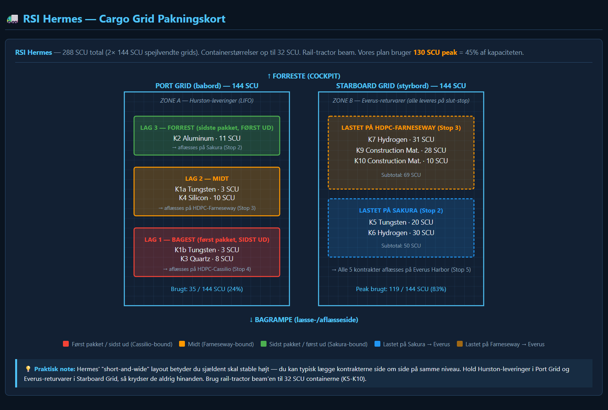
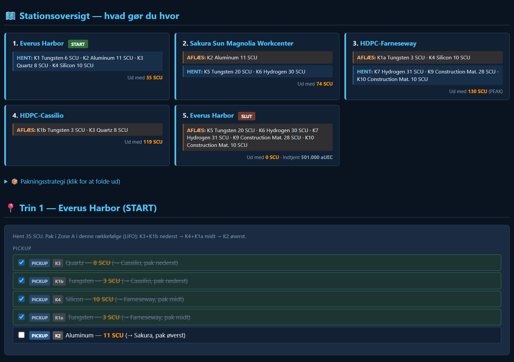

# SC Hauler Planner

Single-file web app that automatically generates optimized transport plans for Star Citizen hauler contracts. Drop in screenshots of your contract screens and the app uses Claude vision API to read pickup, delivery, commodity and SCU, then computes the route, the LIFO loading plan and an interactive checklist you can tick off while flying.

> **Status:** Public alpha. Open for testing and feedback from the SC hauler community.

## Demo

Generated plan from a 9-contract run on Hurston (Everus Harbor → Sakura → HDPC-Farneseway → HDPC-Cassilio → Everus Harbor):

Cargo loading map for the RSI Hermes (mirrored 144 SCU grids), showing the LIFO layers in the Port Grid for Hurston deliveries and the Starboard Grid filled in-flight with Everus-bound return cargo:

Station overview and step-by-step checklist with tick-as-you-go pickups and deliveries:

## Features

- **Drag/drop image upload** — as many contract screenshots as you want
- **Claude vision auto-parse** — extracts station names, commodities, SCU and reward from every contract
- **Auto route** — groups contracts by destination, computes pickup→delivery order to minimize backtracking
- **LIFO loading plan** — last destination packed first; first destination packed last (= first out)
- **Multi-grid ships** — if you fly the Hermes or Caterpillar, the app uses the separate cargo grids to keep local deliveries apart from return cargo
- **17 ships in the database** — from Cutlass Black (46 SCU) to Hull C (4608 SCU). Warns if peak load exceeds capacity
- **Live checklist** — tick off pickups and drops; earned aUEC updates live; contracts lock as "CLOSED" once both pickup and delivery are done
- **Local storage** — checks survive a browser restart
- **Smart error handling** — placeholder/template contracts (game bugs) are skipped automatically

## Run it

**Hosted version:** [scrapwavesurvivor.com](https://scrapwavesurvivor.com) — buy 200 credits for €5 (~10 contract runs), or bring your own Anthropic API key for unlimited usage at cost.

**Self-host / local:** Clone the repo and double-click `index.html`. Toggle the **🔑 Bring your own key** tab, enter your Anthropic API key (stored locally in your browser, grab one at [console.anthropic.com](https://console.anthropic.com/)). Cost: ~$0.01–0.02 per screenshot.

For deploying your own hosted instance with Stripe credits, see [DEPLOY.md](DEPLOY.md).

## Roadmap

- [ ] Persistent contract library (keep parsed contracts across sessions)
- [ ] Ship-grid visualizations for C2, Caterpillar and Hull series
- [ ] Geographic route optimization (distance between stations)
- [ ] Multi-player crew mode (shared cargo, task assignment)
- [ ] Reward/SCU ratio statistics (is this run worth taking?)
- [ ] Mobile-responsive layout
- [ ] Cloudflare Pages deployment under its own subdomain
- [ ] Backend proxy so users don't need their own API key

## Tech

- Pure HTML/CSS/JS — no build step, no framework
- Claude API (Sonnet 4.6 with vision) called directly from the browser
- localStorage for state persistence
- SVG for cargo-grid illustrations

## Contributing

Issues and pull requests welcome. This is a hobby project built around my own SC hauling, so I'm happy to take suggestions and ship-database fixes from the community.

## License

MIT — see [LICENSE](LICENSE). Free to use, fork and build on. If you build something commercial on top, a friendly hello would be appreciated.
