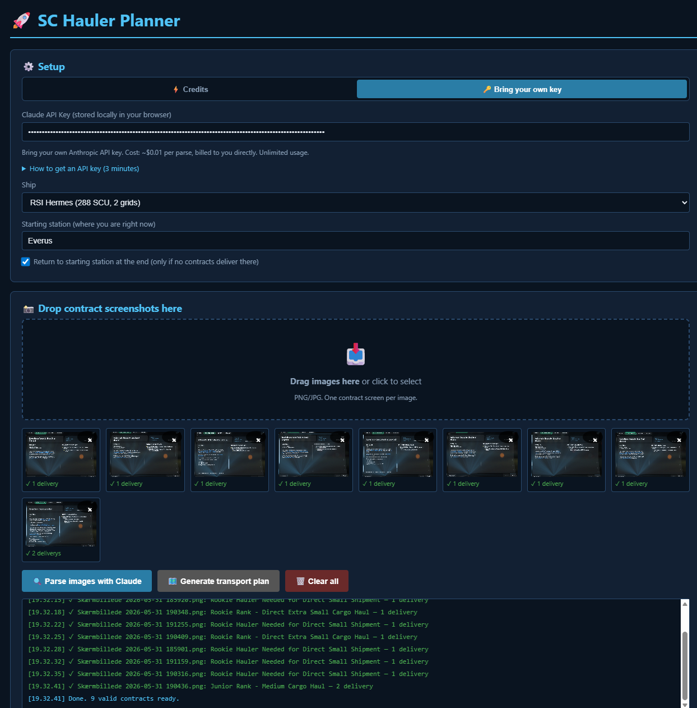
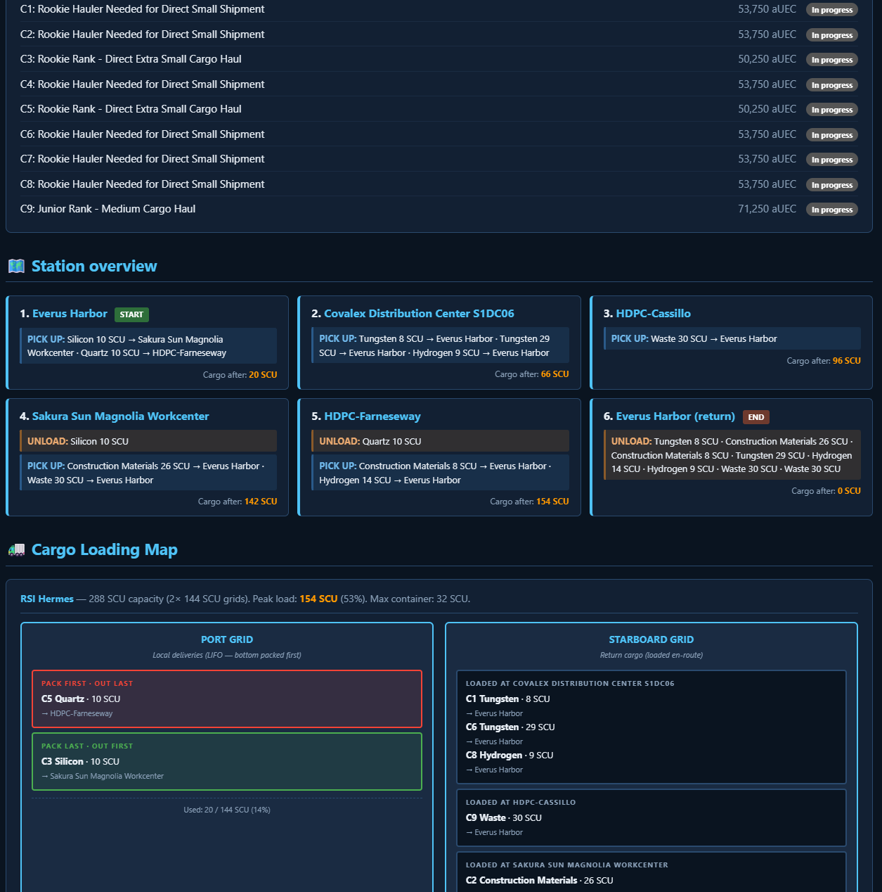
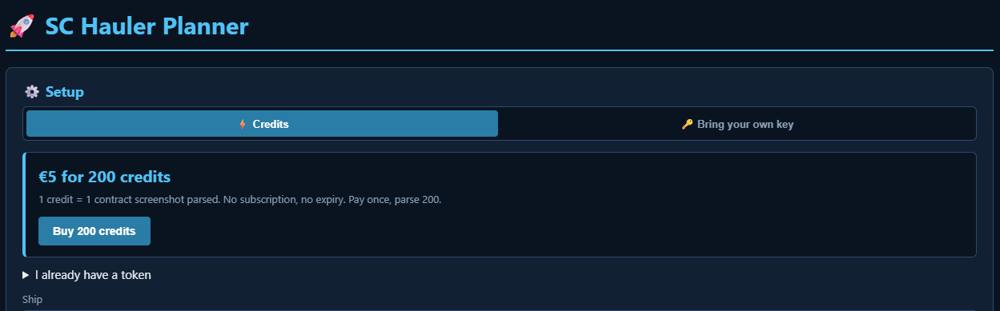

# SC Hauler Planner

Single-file web app that automatically generates optimized transport plans for Star Citizen hauler contracts. Drop in screenshots of your contract screens and the app uses Claude vision API to read pickup, delivery, commodity and SCU, then computes the route, the LIFO loading plan and an interactive checklist you can tick off while flying.

> **Status:** Public alpha. Open for testing and feedback from the SC hauler community.

## Two ways to use this

**Option 1 — Self-host with your own API key (free, available now)**
Clone the repo, double-click `index.html`, paste in your own Anthropic API key, parse away. The key stays in your browser and you're billed by Anthropic directly at cost (~$0.006 per screenshot, so $5 buys you roughly 800 parses). Full source is here for you to inspect, modify, or self-deploy. See [Getting an Anthropic API key](#getting-an-anthropic-api-key-3-minutes) below.

**Option 2 — Use the hosted version with prepaid credits (coming soon)**
If you don't want to mess with Anthropic accounts, you'll soon be able to go to [scrapwavesurvivor.com](https://scrapwavesurvivor.com), buy a pack of 200 credits for €5 (one credit = one screenshot parsed, no subscription, no expiry), and just use the app. Same code, same features, but the API key is on the server side so you don't have to set up anything. Works on phones and shared machines without exposing your key.

Both modes are first-class. BYOK isn't going away — the hosted version exists for users who'd rather pay €5 once than register with Anthropic.

## Demo

A 9-contract Hurston run with the RSI Hermes, starting at Everus Harbor.

**1. Drop in your contract screenshots and let Claude parse them:**

**2. Get the generated plan with station overview and cargo loading map (Port Grid for local Hurston deliveries, Starboard Grid for Everus-bound return cargo loaded en-route):**

## Features

- **Drag/drop image upload** — as many contract screenshots as you want
- **Claude vision auto-parse** — extracts station names, commodities, SCU and reward from every contract
- **Auto route** — groups contracts by destination, computes pickup→delivery order to minimize backtracking
- **LIFO loading plan** — last destination packed first; first destination packed last (= first out)
- **Multi-grid ships** — if you fly the Hermes or Caterpillar, the app uses the separate cargo grids to keep local deliveries apart from return cargo
- **17 ships in the database** — from Cutlass Black (46 SCU) to Hull C (4608 SCU). Warns if peak load exceeds capacity
- **Live checklist** — tick off pickups and drops; earned aUEC updates live; contracts lock as "CLOSED" once both pickup and delivery are done
- **Local storage** — checks survive a browser restart
- **Smart error handling** — placeholder/template contracts (game bugs) are skipped automatically

## Self-hosting it (Option 1)

1. Clone the repo or [download `index.html` directly](https://raw.githubusercontent.com/SergentISAF/sc-hauler-planner/main/index.html) — that one file is the whole app.
2. Double-click it. It opens in your default browser, no server, no install.
3. Toggle the **🔑 Bring your own key** tab and paste your Anthropic API key (see guide below for how to get one).
4. Drop in your contract screenshots and parse.

Your key is stored only in your browser's localStorage and sent directly to Anthropic. Cost: ~$0.006 per screenshot, billed to you by Anthropic.

## The hosted version (Option 2)

Sneak preview of the Credits tab at [scrapwavesurvivor.com](https://scrapwavesurvivor.com) (under construction):

Same app, same features as the local file — only difference is the API key lives on the server, so you buy credits up-front instead of running your own Anthropic account. Useful for:

- Using the tool on a phone or tablet
- Using it on a shared/public machine without leaking your key
- Skipping Anthropic signup entirely (one less account)
- Supporting the project (~70% of the pack price funds further development)

Ship date will be announced on the [r/starcitizen launch post](https://www.reddit.com/r/starcitizen/) once Stripe KYC clears.

## Deploying your own hosted instance

If you want to run your own Cloudflare-hosted instance with Stripe credits (e.g. for your org or a different audience), see [DEPLOY.md](DEPLOY.md) for the full guide.

## Getting an Anthropic API key (3 minutes)

If you go the BYOK route, you'll need a Claude API key from Anthropic. Here's how:

1. Go to [console.anthropic.com](https://console.anthropic.com/) and sign up with email, Google, or GitHub.
2. Verify your email.
3. Click **Billing** in the left sidebar → add a payment method.
4. Top up with **$5–10** in credits (roughly 500–1000 parses).
5. Click **API Keys** in the sidebar → **Create Key**. Name it something like "hauler".
6. Copy the key (starts with `sk-ant-`) — you can only see it once, so save it somewhere safe like a password manager.
7. Paste it into the **Claude API Key** field in the app.

The key is stored only in your browser's localStorage and sent directly to Anthropic — never to any third party server.

> **Security tip:** if you ever paste the key on a shared or public machine, revoke it from the Anthropic console afterwards. The hosted version at scrapwavesurvivor.com avoids this entirely by handling the key server-side.

## Roadmap

- [ ] Persistent contract library (keep parsed contracts across sessions)
- [ ] Ship-grid visualizations for C2, Caterpillar and Hull series
- [ ] Geographic route optimization (distance between stations)
- [ ] Multi-player crew mode (shared cargo, task assignment)
- [ ] Reward/SCU ratio statistics (is this run worth taking?)
- [ ] Mobile-responsive layout
- [ ] Cloudflare Pages deployment under its own subdomain
- [ ] Backend proxy so users don't need their own API key

## Tech

- Pure HTML/CSS/JS — no build step, no framework
- Claude API (Sonnet 4.6 with vision) called directly from the browser
- localStorage for state persistence
- SVG for cargo-grid illustrations

## Contributing

Issues and pull requests welcome. This is a hobby project built around my own SC hauling, so I'm happy to take suggestions and ship-database fixes from the community.

## License

MIT — see [LICENSE](LICENSE). Free to use, fork and build on. If you build something commercial on top, a friendly hello would be appreciated.
